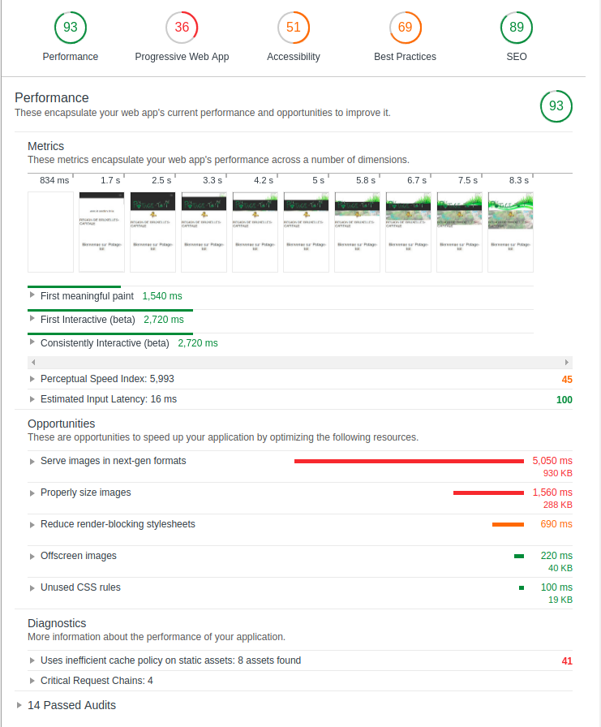

# Fil rouge "guerrilla"

## Quand ?

### Jeudi 31 mai 2018

## Liens des consignes

[https://github.com/becodeorg/lovelace-2/blob/master/Projects/fil-rouge/phase-1.md](https://github.com/becodeorg/lovelace-2/blob/master/Projects/fil-rouge/phase-1.md)

## Qu’est-ce que c’est ?

Un challenge sur le fil rouge "guerrilla" avec une deadline de 6 heures.

Le but du challenge est de réaliser un site sur base d'un autre site qui existe déja.

Le site fourni étant un site (de plusieurs pages) avec quelque défaut, est à transformer en un site one page.

## Ce que j'ai fait:

j'ai fait le site sur base d'un template (pour avoir l'idée du design).

mais je l'ai fait à ma sauce.

j'ai essayer au debut avec le template mais ... pliens de chose ne passer pas comme prévue.

## Progression

En cours ...

## Résulat:

Lien du site de départ: [potage-toit](http://www.potage-toit.be/)

et voici le lien du site one-page [ici](https://ludovichaute.github.io/filrouge-0-guerrilla)

## Lighthouse:

